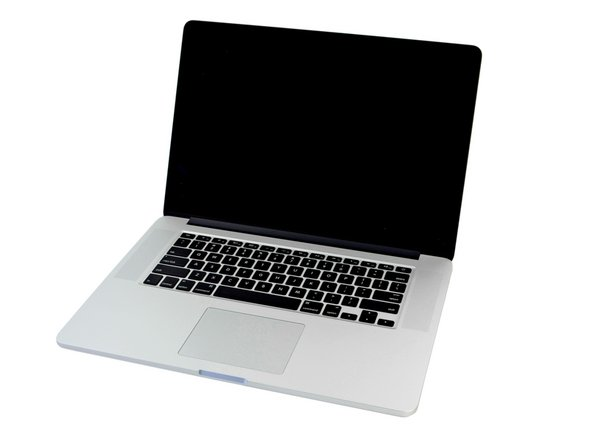
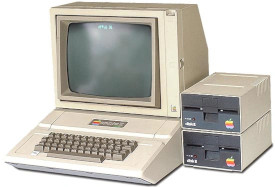
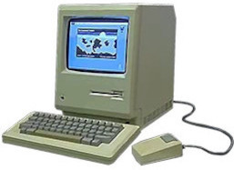
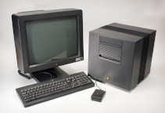
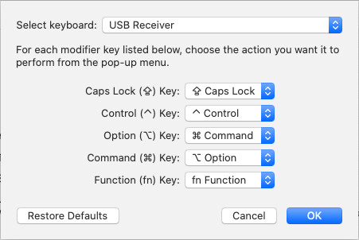

# Mac keys configuration

Macbook is a terrific piece of hardware with great, shiny, bright retina screen with resolution of whooping 2880x1800 (3k), soft, large keyboard (before notorious butterfly) and sturdy design. He is common guest in every second Hollywood movie, actually if you ever see a laptop in a movie, chances are it will probably be Mac. He is a true star. Still there are few things that will annoy every user that was not born with silver spoon (ups. I mean Mac) and has gotten used to windows before or has to connect to windows every now and then using his precious Mac:

1. Applications are not closing when you close all windows
2. Alt-Tab will not bring up minimized applications
3. Alt and Windows keys are switched
4. There is no Insert key
5. There is no PrintScreen key

Notable mentions - Home, End,  PageUp, PageDown and Delete are also not there but can be emulated with Fn + cursor keys and Fn + backspace.

For 1. and 2. we just learn to live with it. With 3. 4. and 5. we will deal in the rest of this document. 

If you install Windows on Mac laptop, 1. and 2. wil be solved, but 3. 4. and 5. will still be a problem and we will describe how to fix it on both, internal and external keyboard.

Now you must be thinking - Yeah right, you will solve Insert and PrintScreen by using external keyboard. No, we will achieve Insert and PrintScreen keys even on internal keyboard without external keyboard connected on both Mac and Windows OS.

Wanna see how? Follow me reader!

## Mac OS configuration

Here we describe keys configuration of Mac OS. We are not in Citrix RDP or in Microsoft Remote Desktop or in Windows. Plain Mac. So you are proud new owner of MacBook, you love your new toy, everything is fine, everything works, life has a meaning. It is little strange that Copy, Paste, Find, ... are Alt-C and Alt-V Alt-F instead of Ctrl-C Ctrl-V Ctrl-F, but you get used to it. After all, Alt key is closer, so it is easier to type combos - no little finger gymnastics. You are thinking about switching Control and Alt, but then you would have to switch it back in Terminal where Ctrl-C and Ctrl-V still have some function (interrupt and control character insert) and in remote windows. You would also have to fix Alt-Tab which would now be Ctrl-Tab, so you just keep everything as is.

Problems really start when you connect external keyboard. First thing you notice is that Mac or Command key is not really Alt! It is more like Windows key on a wrong position. Oh noooooooo! Why Apple, why? Why couldn't you go to poor neighbor that doesn't have money for expensive stuff, so only has PC and see how his keyboard looks like. How could you change ten hardware architectures, from 6502 to Motorola 68000 to PowerC to Intel and finally ARM, and OS from Apple DOS to MacOS to NeXTSTEP to Darwin with Mach 3 kernel but keyboard keys could not be set straight through all this time? Don't you feel suffering and sorrow of your fellow users. Don't you care about your users. Don't you hear the trumpets calling in the distance...

  

Alas, worry not my brother, we are here to help and wrong every right or make every right wrong, or ... where was I ... :)

So, after connecting external windows keyboard you notice that Mac internal keyboard has key order (we will talk in windows terms) Control Alt Windows so your favorite shortcuts were not Alt-Tab, Alt-C, Alt-V, Alt-F but Win-Tab, Win-C/V/F and accordingly on external keyboard they will not work with third key - (Control Windows) Alt - but with second - Windows, which is not how it is intended to be. To fix it and keep your finger motorics the only logical thing to do is remap Alt and Win only for external keyboard without changing internal keyboard setup.

Apple -> System Preferences -> Keyboard -> Modifier keys - make sure you select your USB keyboard and not Apple Internal Keyboard/Trackpad!
- Option \ key sends % Command
- Command % key sends \ Option

## Citrix configuration

Citrix is very tricky to configure everything to work fine in Windows RDP session. Citrix likes to block some keys and key combos. I was searching for years for good setup that would enable Alt-Tab and Alt-Shift-Down for multi-cursor in Notepad++ or VSCode and I think i found it. Still up to today I didn't find a way to get Ctrl-Alt-Down to get through so I reconfigured VSCode to use Alt-Shift-Down instead - same as Notepad++.

## Microsoft Remote Desktop configuration

Configuring Citrix RDP will not fix keys in Microsoft Remote Desktop. We will fix them.

## Microsoft Windows configuration

If you by any change manage to install Windows on Macbook here you can see how to configure keys to make your life easier or just worth living.
