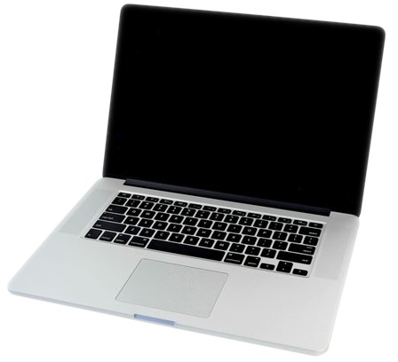
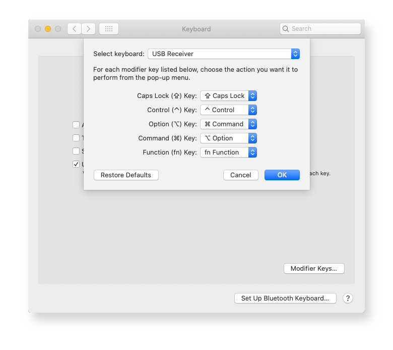
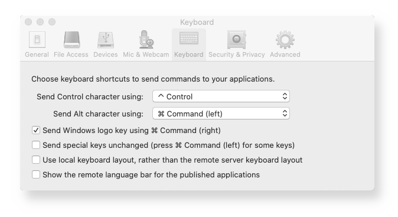

# Mac keys configuration

Macbook is a terrific piece of hardware with great, shiny, bright IPS retina screen with resolution of whooping 2880x1800 (3k), soft, large keyboard (before notorious butterfly) and sturdy design. He is common guest in every second Hollywood movie, actually if you ever see a laptop in a movie, chances are it will probably be Mac. He is a true star. Still there are few things to be wished for that will annoy every user that was not born with silver spoon (ups. I mean Mac) and has gotten used to windows before or has to connect to windows every now and then using his precious Mac.

**Problems:**  
1. Applications are not closing when you close all windows
2. Alt-Tab will not bring up minimized applications
3. Alt and Windows keys are switched
4. There is no Insert key
5. There is no PrintScreen key

**Honorable mentions:**  
Home, End,  PageUp, PageDown and Delete are also not there but can be emulated with Fn + cursor keys and Fn + backspace.

For 1. and 2. we just learn to live with it. With 3. 4. and 5. we will deal in the rest of this document. 

If you install Windows on Mac laptop, 1. and 2. wil be solved, but 3. 4. and 5. will still be a problem and we will describe how to fix it on both, internal and external keyboard.

Now you must be thinking - yeah right, you will solve Insert and PrintScreen by using external keyboard. No, we will achieve Insert and PrintScreen keys even on internal keyboard without external keyboard connected on both Mac and Windows OS.

Wanna see how? Follow me reader!

## Mac OS configuration

Here we describe keys configuration of Mac OS. We are not in Citrix RDP or in Microsoft Remote Desktop or in Windows. Plain Mac. So you are proud new owner of MacBook, you love your new toy, everything is fine, everything works, life has a meaning. It is little strange that Copy, Paste, Find, ... are Alt-C and Alt-V Alt-F instead of Ctrl-C Ctrl-V Ctrl-F, but you get used to it. After all, Alt key is closer, so it is easier to type combos - no little finger gymnastics. You are thinking about switching Control and Alt, but then you would have to switch it back in Terminal where Ctrl-C and Ctrl-V still have some function (interrupt and control character insert) and in remote windows. You would also have to fix Alt-Tab which would now be Ctrl-Tab, so you just keep everything as is.

Problems really start when you connect external keyboard. First thing you notice is that Mac or Command key is not really Alt! It is more like Windows key on a wrong position. Oh noooooooo! Why Apple, why? Why couldn't you go to poor neighbor next door that doesn't have money for expensive stuff, so only has PC and see how his keyboard looks like. How could you change ten hardware architectures, from 6502 to Motorola 68000 to PowerC to Intel and finally ARM, and OS from Apple DOS to MacOS to NeXTSTEP to Darwin with Mach 3 BSD kernel but keyboard keys could not be set straight through all this time? Don't you feel suffering and sorrow of your fellow users. Don't you care about your users. Don't you hear the trumpets calling in the distance... :)

  

Alas, worry not my brother, we are here to help and wrong every right or make every right wrong, or ... where was I ... :)

So, after connecting external windows keyboard you notice that Mac internal keyboard has key order (we will talk in windows terms) **Control Alt Windows** while external keyboards have order **Control Windows Alt** so your favorite shortcuts were not Alt-Tab, Alt-C, Alt-V, Alt-F but Win-Tab, Win-C/V/F and accordingly on external keyboard they will not work with third key - Alt - but with second - Windows, which is not how we got used to. To fix it and keep your fingers motorics same on both keyboards the only logical thing to do is to switch Win and Alt keys on external keyboard.

Ctrl-Alt-Win vs Ctrl-Win-Alt:  
 &nbsp; &nbsp; 

### Switching Win and Alt on external keyboard

This can be done with settings included in every Mac.  
Apple Menu -> System Preferences -> Keyboard -> Modifier Keys -> Select your USB keyboard  
- Option \ key sends % Command
- Command % key sends \ Option

That will "fix" issue 3. - Alt and Win keys are switched. Actually we didn't even fix it, internal keyboard still has Win and Alt switched, and now external also, but at least they are both wrong in same way so familiar shortcuts like "Alt"-Tab, "Alt"-X/C/V/F will work "same" on both keyboards. Two wrongs make one right :).

Regarding 4. and 5. - missing Insert and PrintScreen keys I used to live with that for years thinking "Oh, it would be so nice if I had these keys, what can you do, it's not possible...", but it is possible and solution is so easy once you get out of mind box it's not possible into mind box how can i do it. You will not need it often, but enough that you feel anxious every time you need them and they are not available. 

For example in Unix terminals on windows like Putty, Git bash or new MS Windows Terminal Ctrl-C Ctrl-V are not available because they mean interrupt and insert special character, so you get used to using Ctrl-Insert Shift-Insert. Then as we are all victims of habit you want to use same on your Mac terminal or iTerm. You can do it with mouse also cause you have Copy on Select and Paste on Right Click configured but sometimes Shift-Insert is faster and more handy.

PrintScreen is used in windows for screen capture when you want to take a picture of some settings like in this document. Again when you get used to it you want to do same simple step in Mac, you don't want to remember 100 mambo jumbo key combinations like Shift-Command-3,4,5 and Ctrl-Shift-Command-3,4. I have to admit every time i need screenshot on Mac I have to google what are the keys. To avoid this we will:

1. Create PrintScreen out of thin air on internal Macbook keyboard
2. Remap it to Command-Shift-5 which gives most versatile screenshot on Mac with choice of full screen, one window or rectangular area

So, how to create keys out of thin air. It cannot be done with tools included with Mac OS. We will have to use Karabiner-Elements simple bindings which map keys one to one. One physical key will  always be mapped to another. We only have to find some unused keys on internal keyboard. Our choice and probably only choice are two keys on the right of space - Right Command and Right Option. They are really never used, not needed and anyone can live without them. I came to this idea by looking at my Lenovo ThinkPad which has PrintScreen at exactly same place - on the right of space, between Right Alt and Right Control. Somehow all other laptop producers (except Apple) concluded that out of three ancient keys on top - PrintScreen/SysRq, Scroll Lock and Pause/Break - you can safely eliminate two - Scroll Lock and Break - no one will miss them, but you have to keep Print Screen.

### Adding Insert and PrintScreen to internal keyboard

Install Karabiner-Elements -> Click on Karabiner icon in menu bar on top -> Preferences  
In Preferences select Simple modifications and Add items:  
- From: right_command To: print_screen
- From: right_option To: insert

And voilà, we created Insert and PrintScreen keys out of thin air.

Regarding mapping PrintScreen to Command-Shift-5 in Mac - that will need Karabiner Complex modifications - we will deal with it in the second last chapter - MS remote desktop - you will see why.

On another unrelated note, if using Control-X/C/V/O/S/Z/Y/F/A for Cut/Copy/Paste/Open/Save/Undo/Redo/Find and Select All on windows and having to use Command instead on Mac is killing you, you can remap all those shortcuts in native Mac keyboard config. The other option is to switch completely Control and Command but we didn't go that route because it would impact Alt-Tab, citrix, remote desktop, unix terminal, ...

### How to map Ctrl-X/C/V/O/S/Z/Y/F/A to Cut/Copy/Paste/...

Go to Apple Menu -> System Preferences -> Shortcuts -> App Shortcuts and add (+):  

This will change every application that has Cut/Copy/Paste/... in menu commands to use new shortcuts. If name in the menu is bit different for example "Find Pattern" or "Find..." it will not work - you will have to add exact name of the menu command. In finder Ctrl-C will not work because finder puts file name into Copy menu command - for example Copy "README.md" for this file. Paste is Paste Item instead of just Paste - it can be fixed by adding Paste Item in App Shortcuts but Ctrl-C cannot be fixed.

## Citrix configuration

Citrix is very tricky to configure everything to work fine in Windows RDP session. Citrix and Mac like to block some keys and key combos. I was searching for years for good setup that would enable Alt-Tab with real Alt - one next to Space and Alt-Shift-Down for multi-cursor in Notepad++ or VSCode and I finally found it on some page on Internet. Still up to now I didn't find a way to get Ctrl-Alt-Down to get through Citrix so I reconfigured VSCode to use Alt-Shift-Down for multi cursor instead - same as Notepad++.

If you remember from previous chapter and those are the settings that we start from, we have (in the order of keys on keyboard):

Internal keyboard:
- Ctrl sends Ctrl
- Left Option sends Option/Alt
- Left Command sends Command/Win

External keyboard:
- Ctrl sends Ctrl
- Win send Option/Alt because this is Option position on Mac
- Alt sends Command/Win because this is normal position for Command key on Mac

So after mapping on both internal and external keyboard order of keys is Ctrl-Alt-Win:
- Ctrl
- Option/Alt
- Command/Win

Now, our goal is simple - since with Citrix we are connecting to windows, Ctrl-Alt-Win order should be changed to Ctrl-Win-Alt, either with Karabiner or Citrix configuration or native Mac tools. But it is not so simple. First let's see what are keyboard configuration options in Citrix.

### How to map keys in Citrix

Citrix Viewer menu -> Preferences -> Keyboard
- Send Control using ^ Control
- Send Alt using left % Command
- Send Windows logo using right % Command - checked

As we can see, we can chose what sends Control, what sends Alt, but not what sends Win key. Default for Win key is of course Command which we can't use because we want it to be Alt. So we chose only other option available - send it as right Command.

Second part of configuration is done in Karabiner. Control and Alt are already mapped. Nothing to do in Karabiner. What we need Karabiner for is to map left win to right command and because Mac will take control of Alt-Tab (Command-Tab) and give Mac tasks list instead of Windows tasks list we have to trick it somehow.

For that we will need Karabiner Complex modifications. You can search and download hundreds of Karabiner modifications from internet. When downloaded they are saved into your home folder in:

	~/.config/karabiner/assets/complex_modifications  

Every downloaded file has a title and a list of rules.
We can also download json files from this repo to that folder and they will appear on the list.

Our json files in karabiner subfolder are:

- citrix.json - for Ctrl-Win-Alt order (normal windows order - we use this one)
- citrix2.json - Ctrl, Alt, Windows order (Mac order - not used)
- ctrl-alt-down.json - tried to make ctrl-alt-down work in citrix - it doesn't work
- printsceen.json - PrintScreen button configuration for Mac and MS remote desktop
- swap_alt_cmd_rdp.json - Swap left alt and left win for RDP

After rule is enabled it goes into:

	~/.config/karabiner/karabiner.json  

### How to configure Karabiner for Citrix

These are the rules that we have in Karabiner:

For now in karabiner Complex modifications we will enable first two rules - the rest will come in later chapters:
- In Citrix send Tab with Fn so that Citrix doesn't block it - this will fix Alt-Tab being stolen by Mac OS when we are in Citrix
- In Citrix send right Command on left Option (Win key) - this will work because Citrix expects right ctrl as Win key (check above)

## Microsoft Remote Desktop configuration

Configuring Citrix RDP will not fix keys in Microsoft Remote Desktop. We will fix them.

## Microsoft Windows configuration

If you by any chance manage to install Windows on Macbook here you can see how to configure keys to make your life easier or just worth living.
